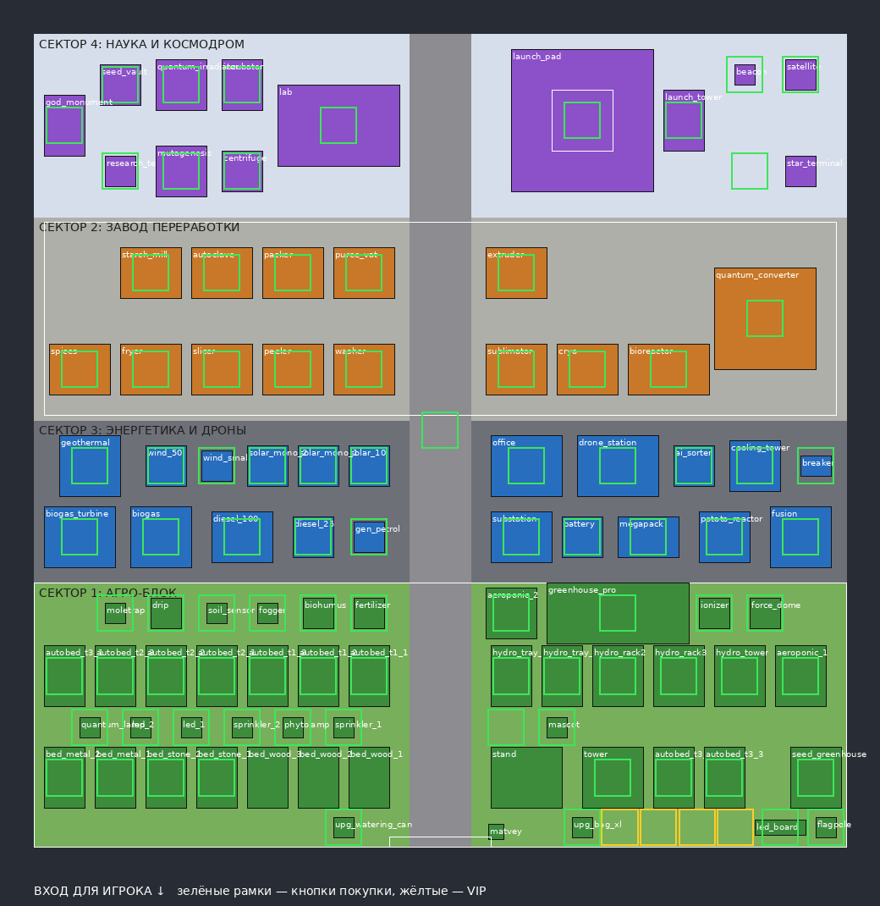

# 🥔 Potato Tycoon — Картофельный Магнат (Roblox)

Модульный авто-тайкон по [ГДД](docs/GDD.md): от лопаты и трёх грядок до квантовой селекции, космодрома и Rebirth.
Никаких конвейеров — урожай собирается и продаётся сам, цеха работают как множители выручки.

* 5 этапов, ~2–2.5 часа до первого Rebirth (баланс проверен симулятором);
* 92 покупаемых постройки по 4 секторам базы 80x80, 13 сортов картофеля, 19 видов персонала и дронов;
* энергосеть с перегрузкой, события «Нашествие жуков» и «Картофельный бум», офлайн-доход;
* Rebirth (x3^N), Картофельные Звезды и древо звёздных технологий;
* 4 геймпасса из ГДД, сохранения в DataStore, 6 игроков на сервере.



## Быстрый старт

### Вариант А — просто открыть в Roblox Studio

1. Скачайте [`PotatoTycoon.rbxlx`](PotatoTycoon.rbxlx) и откройте его в Roblox Studio.
2. Нажмите **Play** — мир, базы и интерфейс строятся скриптами при запуске.

### Вариант Б — разработка через Rojo (рекомендуется)

Код живёт в `src/`, Studio синхронизируется с ним через [Rojo](https://rojo.space).

```bash
# инструменты (rojo, selene, stylua, lune) — версии в aftman.toml
aftman install          # или: rokit install

rojo serve              # и подключитесь плагином Rojo в Studio
# или собрать файл места:
rojo build default.project.json -o PotatoTycoon.rbxlx
```

## Публикация игры

1. **File → Publish to Roblox**.
2. **Game Settings → Security → Enable Studio Access to API Services** — чтобы работали сохранения в Studio.
3. **Game Settings → Places → Max Players = 6** (на сервере 6 баз).
4. Создайте 4 геймпасса (Creator Hub → Monetization → Passes) и впишите их ID в
   [`src/shared/Config/GamePasses.luau`](src/shared/Config/GamePasses.luau).
5. Замените звуки-заглушки на свои ID в [`src/shared/Config/Sounds.luau`](src/shared/Config/Sounds.luau).

## Как играть

| Этап | Что делать |
|---|---|
| 1. Ручной огород | Возьми лопату, кликай по созревшим кустам, сдавай урожай скупщику. Копи $1,500 на Авто-вышку. |
| 2. Авто-поля | Ставь авто-грядки, спринклеры, лампы и генераторы. Открывай сорта в меню 🧬. |
| 3. Фабрика снеков | Построй фабричный корпус и цеха-множители: мойка, чипсы, фритюр, специи. |
| 4. Индустрия | Станция дронов, найм персонала 🤖, крио-туннель, сублиматор, биореактор, премиальные сорта. |
| 5. НИИ и космос | Лаборатория ДНК, сорта конца игры, квантовый преобразователь x100, шаттл и Rebirth 🚀. |

Покупки — напольные кнопки на базе (зелёная — хватает денег, красная — нет). Меню слева:
🧬 Сорта · 🤖 Персонал · ⭐ Звёзды · 🚀 Rebirth · 💎 Магазин · 📊 Доход · 🏠 Домой.

## Структура проекта

```
default.project.json        дерево места для Rojo
PotatoTycoon.rbxlx          собранное место (rojo build)
src/shared/                 → ReplicatedStorage.Shared
  Config/                   ВЕСЬ баланс и контент: постройки, сорта, персонал, технологии, геймпассы, звуки
  Economy.luau              формулы ГДД 2.1 (общие для сервера, клиента и симулятора)
  Format.luau, Remotes.luau
src/server/                 → ServerScriptService.Server
  Main.server.luau          запуск, вход/выход игроков, автосохранение
  Services/                 данные, базы, покупки, ручной этап, доход, события, Rebirth, геймпассы
  World/                    генерация мира и ~90 процедурных 3D-моделей
src/client/                 → StarterPlayerScripts.Client
  UI/                       HUD, окна меню, уведомления
  Controllers/              анимации, рост кустов, клики, эффекты, звуки
tools/                      симулятор баланса, автотюнер цен, проверка раскладки, смоук-тест
docs/                       ГДД, реализация, каталог 210 ассетов, план базы
```

## Где менять баланс

* Цены, урожай, множители, энергия построек — [`Config/Items.luau`](src/shared/Config/Items.luau).
* Сорта (цена $/кг, урожайность, цена исследования) — [`Config/Varieties.luau`](src/shared/Config/Varieties.luau).
* Персонал и дроны — [`Config/Staff.luau`](src/shared/Config/Staff.luau); звёздные технологии — [`Config/StarTech.luau`](src/shared/Config/StarTech.luau).
* Тайминги, события, Rebirth, офлайн-доход — [`Config/Game.luau`](src/shared/Config/Game.luau).

После правок прогоните симулятор и, при желании, автотюнер:

```bash
luau tools/simulate.luau               # таймлайн и лог покупок
luau tools/simulate.luau -a noevents   # игрок без событий
python3 tools/tune.py luau 8           # подогнать цены под таймлайн ГДД
luau tools/layout.luau                 # проверить, что постройки и кнопки не пересекаются
python3 tools/render_layout.py luau    # перерисовать docs/layout.png
```

Для тестов в Studio в `Config/Game.luau → Debug` можно дать стартовые деньги (`StartCash`) и ускорить события
(`FastEvents`), а в `Config/GamePasses.luau` — выдать себе все геймпассы (`GrantAllInStudio`).

## Проверки

```bash
selene src tools                                       # линтер
stylua --check src tools                               # форматирование
mkdir -p build && rojo build default.project.json -o build/PotatoTycoon.rbxlx
lune run tools/smoke_test.luau build/PotatoTycoon.rbxlx
```

Смоук-тест в [Lune](https://lune-org.github.io/docs) выполняет настоящий код игры без Studio: генерирует мир,
строит все модели, покупает весь каталог, нанимает персонал, проводит событие жуков и Rebirth, открывает все окна
интерфейса. Те же проверки запускает GitHub Actions (`.github/workflows/ci.yml`).

## Документация

* [docs/GDD.md](docs/GDD.md) — исходный ГДД (оригинал: [docx](docs/Potato_Tycoon_GDD.docx)).
* [docs/IMPLEMENTATION.md](docs/IMPLEMENTATION.md) — как ГДД реализован, решения по балансу, таймлайн.
* [docs/ASSETS.md](docs/ASSETS.md) — все 210 ассетов ГДД и где они в игре.

## Что дальше

* 3D-модели сейчас процедурные (собраны из деталей) — их можно заменить на MeshPart-модели художника,
  сохранив ключ `model` в конфиге.
* Звуки — встроенные заглушки Roblox; нужны ID из Creator Store.
* 12 ассетов ГДД помечены как резерв (варианты барабанов специй, крокеты, личинка жука и др.) — готовые
  кандидаты на обновления.
